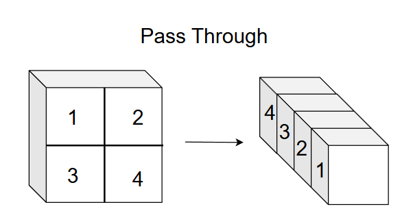

<h1 style="text-align:center;">Yolo V2</h1>

## Basic

- 框
  - anchor: 预选框，从聚类中来
  - gt: 真实框
  - pred: 预测框
- dimension priors: 采用 k-means 聚类方法对训练集中的标准框做了聚类分析，获取anchor boxes，yolov2聚5类
  1. 线性归一化，$w_{norm}=w/W_{img}$
  2. 计算IOU距离($D_{IOU}=1-IOU(box,centorid)$)并归类
  3. 更新类中心
  4. 线性反归一化
- 正负样本
  - 正样本: 一个网格里的5个Anchor与真实框的IOU最大的为正样本，如果$IOU>0.6$，也视为正样本，即使没有$IOU>0.6$的样本，最大IOU的也是正样本
  - 负样本: $IOU<0.5$
  - 忽略样本: $0.5<IOU<0.6$

## Process

- $input=$
- middle precess
  - Conv2d
  - BatchNorm
  - leakyReLU
  - MaxPool2d
  - Path Through

    
- output
  - $output=channel\cdot S \cdot S=channel\times 13 \times 13$
  - $channel=N_{anchor}\times((tx,ty,tw,th,conf)+C)=5\times (5+C)$
    - tx,ty: 边界框中心相对于当前网格的归一化偏移量($x=sigmoid(tx),x\in(0,1)$，相对于该网格)
    - tw,th: 边界框宽高相对于 Anchor 的缩放系数($w=w_{anchor}e^{tw},w\in(0,1)$，相对于图像)
    - conf: 置信度confidence
    - $N_{anchor}$: anchor的个数，yolov2中=5，实际可=9

## Loss

- 定位损失：聚焦正样本的边界框精准度
  $$Loss_1=\lambda_{coord}\sum^{S^2}_{i=0}\sum^B_{b=0}I^{obj}_{ib}[(\hat t_x-t_x^*)^2+(\hat t_y-t_y^*)^2+(\hat t_w-t_w^*)^2+(\hat t_h-t_h^*)^2]$$
  - $\lambda_{coord}$: =5
  - S: 网格数=13
  - B: 一个网格的Anchor数=5
  - $I^{obj}_{ib}$: 指示器函数，当第i个网格的第b个anchor是正样本时=1，否则=0
  - $\hat t_x$: 预测值
  - $t_x^*$: 真实值
- 置信度损失
  $$Loss_2=\sum^{S^2}_{i=0}\sum^B_{b=0}[I^{obj}_{ib}(\hat c-c^*)^2+\lambda_{noobj}I^{noobj}_{ib}(\hat c-0)^2]$$
  - $I^{noojb}_{ib}$: 当第i个网格的第b个Anchor是负样本时=1，否则=0
  - $\lambda_{noobj}$: =0.5
  - $c^*$: 置信度
    - 正样本: $c^*=IOU(pred,gt)$，真实框gt，预测框pred
    - 负样本: $c^*=0$
    - 忽略样本: 不参与计算
  - $\hat c$: 模型预测出的置信度
- 分类损失
  $$\sum^{S^2}_{i=0}\sum^B_{b=0}I^{obj}_{ib}\sum^C_{k=0}(\hat p_k-p_k^*)^2$$
  - C: 类别数量
  - $p_k^*$: 是该类别=1
  - $\hat p_k$: 预测值
