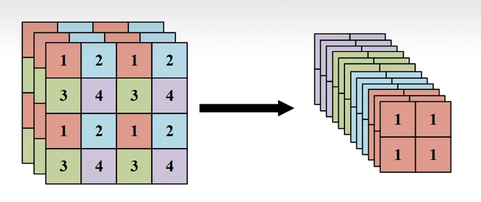

<h1 style="text-align:center;">Yolov5</h1>

## Basic

- Mosaic: 马赛克数据增强，将四个物体拼接在一起，形成一个新的输入数据
- 自适应图片缩放
  - 训练阶段，将图片较长边缩放为608，短边填充灰色
  - 推理阶段，将图片较长边缩放为最近的32的倍数，然后短边也填充至32倍数，最大程度保证图片不失真，但是output有所改变
    $$output=\frac{W}{32}\frac{H}{32}*3*85, \frac{W}{16}\frac{H}{16}*3*85, \frac{W}{8}\frac{H}{8}*3*85$$
- 自适应anchor计算: 通过K-Means算法聚类9种anchor
- 正负样本规定，先设定IOU阈值$0\lt a\lt b\lt 0$
  - $IOU(anchor, gt)\gt b$为正样本，因此可以有多个正样本
  - $IOU(anchor, gt)\lt a$为负样本
  - $a\lt IOU(anchor, gt)\lt b$为忽略样本
- 余弦退火算法: 动态更新学习率
- 模型参数因子

  | type | depth_multiple | width_multiple |
  | --- | --- | --- |
  | medium/m | 0.67 | 0.75 |
  | large/l | 1.00 | 1.00 |
  | xlarge/x | 1.33 | 1.25 |
  | small/s | 0.33 | 0.50 |
  | nano/n | 0.33 | 0.25 |

  - depth_multiple: 深度影响系数，只影响C3的ResUnit的数量
  - width_multiple: 宽度影响系数，只影响每层2d卷积的通道数量

## Precess

- $input=3*608*608$
- middle precess
  - C3: 包含n个重复ResUnit单元的模块
  - ResUnit: 残差单元
  - SPPF: 空间金字塔池化改进
  - Up Sampling 像图像放大一样的操作
  - SiLU: 激活函数
  - Focus:
    

- $output=19*19*3*85, 38*38*3*85, 76*76*3*85$
  - 3个大物体，3个中物体，3个小物体
  - 85=(x,y,w,h,conf)+80个coco数据集类别
  - 13\*13用于检测大物体，将图像划分为13\*13个区域
- 结果认定，先将所有框放在一起，然后同Yolov1

## Loss

- 整体
  $$Loss_{total}=\lambda_{box}\cdot Loss_{box}+\lambda_{obj}\cdot Loss_{obj}+\lambda_{cls}\cdot Loss_{cls}$$
  - $\lambda_{box}=0.05$: 边界框损失权重
  - $\lambda_{obj}=1$: 置信度损失权重
  - $\lambda_{cls}=0.5$: 分类损失权重
- 边界框回归损失 Box Loss: CIoU Loss
  $$Loss_{box}=1-CIoU(pred,gt)$$
  - CIoU: 边界框回归损失
  区别于MSE均方误差，同时考虑pred与gt的重叠面积、中心点距离、长宽比一致性
  $$CIoU=IoU(pred,gt)-\frac{\rho^2(pred,gt)}{c^2}-\alpha\cdot v$$
  - pred预测框、gt实际物体框、anchor预选框
  - $\rho$: 欧式距离
  - c: 能够同时包含pred与gt的最小外接矩形的对角线长度
  - $\alpha=\frac{v}{(1-IoU)+v}$: 权重系数
  - $=\frac{4}{\pi^2}(\arctan\frac{w^{gt}}{h^{gt}}-\arctan{w^{pred}}{h^{pred}})^2$: 长宽比一致性度量
- 置信度目标损失: 二元交叉熵BCEWithLogitsLoss
  $$Loss_{obj}=-[y_{obj}\log(\sigma(p_{obj}))+(1-y_{obj})\log(1-\sigma(p_{obj}))]$$
  - $y_{obj}$: 真实标签，正样本=1，负样本=0
  - $p_{obj}$: 模型预测的置信度（未经过sigmoid）
- 分类损失: Classification Loss
  $$Loss_{cls}=-\frac{1}{N_{pos}}\sum^{N_{pos}}_{i=1}\sum^C_{c=1}[y_{i,c}\log(\sigma(p_i,c))+(1-\sigma(\hat y_{i,c}))]$$
  - $N_{pos}$: 正样本数量
  - C: 类别数
  - $y_{i,c}$: 第i个样本属于类别c，则=1，否则=0
